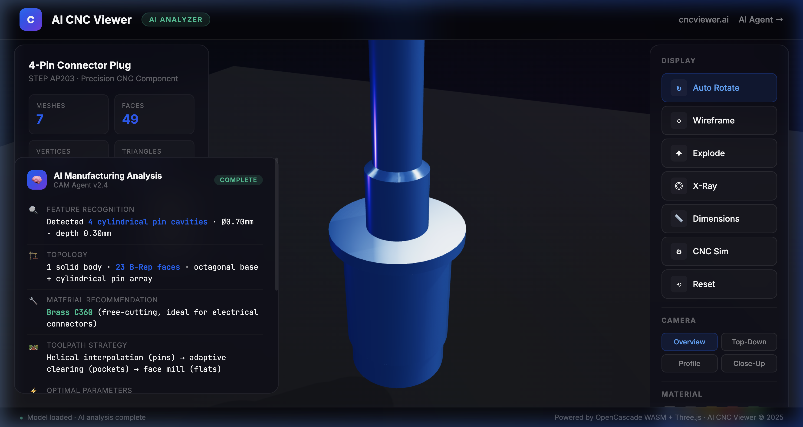

# 🏭 Limitless CNC — AI-Powered STEP Analyzer

Interactive 3D viewer for CNC machining analysis. Upload any STEP file and get instant AI manufacturing insights.

**[🔗 Live Demo](https://yonatanbitton.github.io/limitless-cnc-viewer/)**

## Features

- 🧠 **AI Manufacturing Analysis** — Feature recognition, material recommendations, toolpath strategy, cycle time savings
- ⚙ **CNC Machining Simulation** — Watch raw stock material get carved into the final part (3 phases: Roughing → Semi-Finish → Finishing)
- 📏 **3D Dimension Annotations** — Toggle engineering callouts in 3D space
- 🎬 **Cinematic Camera Presets** — Overview, Top-Down, Profile, Close-Up with smooth transitions
- 📂 **Drag-and-Drop Upload** — Load your own .stp/.step files
- 🌐 **HDRI Reflections** — Photorealistic metallic rendering

## Tech Stack

| Component | Purpose |
|-----------|---------|
| [Three.js](https://threejs.org/) r160 | 3D rendering engine |
| [occt-import-js](https://github.com/niclaslindstedt/occt-import-js) | STEP → mesh via WebAssembly |
| CSS2DRenderer | 3D dimension labels |
| RoomEnvironment | Procedural HDRI |

## About

Built for [Limitless CNC](https://limitlesscnc.ai/) — an AI CAM Agent that integrates with NX-CAM to automate CNC programming.
